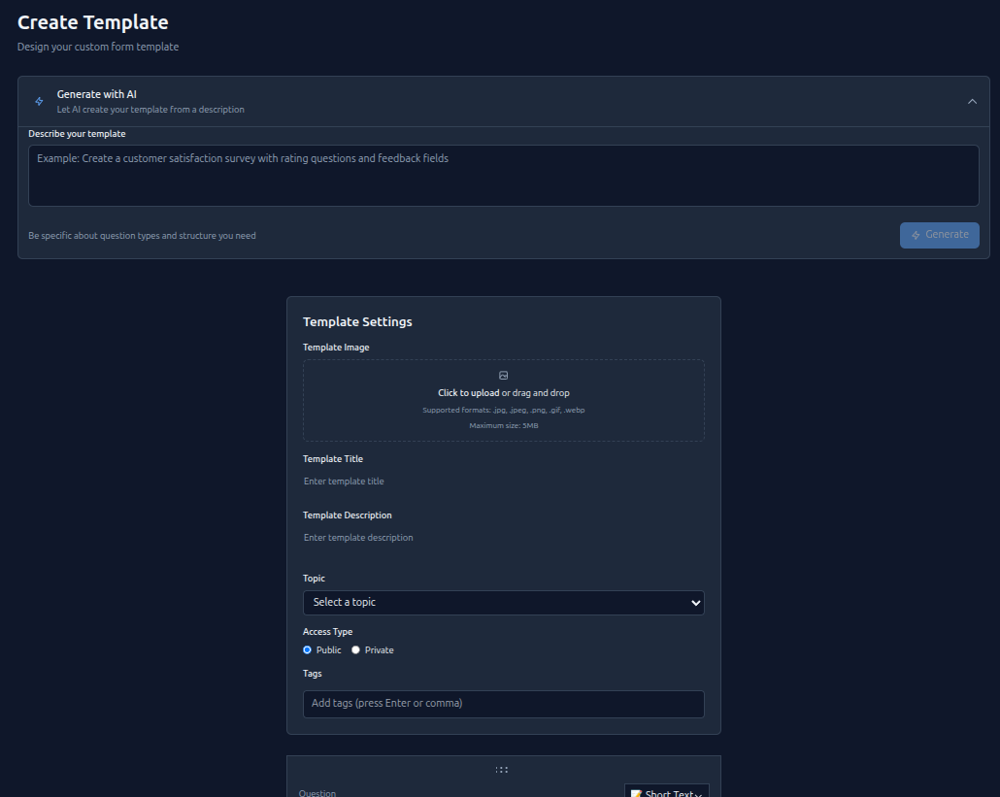

# FormFlow - Веб-приложение для кастомизируемых форм

FormFlow представляет собой полнофункциональное веб-приложение для создания и управления пользовательскими формами, опросами, тестами и анкетами, аналогично Google Forms.

## Технический стек

#### Backend (.NET)
- **C# (обязательный)**
- **ASP.NET Core/.NET 9.0**
- **Entity Framework Core** (ORM)
- **SQL Server** (база данных)
- **SignalR** (real-time комментарии)
- **JWT Authentication**
- **Google OAuth 2.0**

#### Frontend (React)
- **React 18+**
- **TypeScript**
- **Tailwind CSS** (CSS framework)
- **React Router** (маршрутизация)
- **React Hook Form** (обработка форм)
- **Lucide React** (иконки)
- **Recharts** (аналитика и графики)

#### Дополнительные сервисы
- **AI Template Service** (Node.js + NestJS)
- **Cloudinary** (загрузка изображений)
- **Docker** (контейнеризация)

## Основной функционал

#### Аутентификация и авторизация
- Регистрация и вход через email/пароль
- Google OAuth авторизация
- Система ролей (User/Admin)
- JWT токены для безопасности

#### Управление шаблонами
- Создание шаблонов форм с различными типами вопросов
- ИИ-генерация шаблонов на основе описания
- Версионность шаблонов
- Публичные и приватные шаблоны
- Теги и темы для категоризации
- Загрузка изображений в облако

#### Типы вопросов
- Короткий текст (до 4 полей)
- Длинный текст (до 4 полей)  
- Целые числа (до 4 полей)
- Чекбоксы (до 4 полей)
- Одиночный выбор
- Множественный выбор
- Выпадающий список
- Шкала оценки
- Рейтинг (звезды)
- Дата и время

#### Социальные функции
- Система лайков
- Комментарии с real-time обновлениями
- Подписки на уведомления о новых ответах
- Полнотекстовый поиск

#### Аналитика и отчеты
- Статистика заполнений по дням/часам/месяцам
- Агрегированные результаты ответов
- Экспорт данных
- Визуализация данных через графики

#### Административная панель
- Управление пользователями
- Блокировка/разблокировка аккаунтов
- Назначение админских прав
- Просмотр всех шаблонов и форм

## Мультиязычность и темы

- **Поддержка языков**: English, Русский и др (задаются из базы данных)
- **Темы оформления**: Light, Dark, Purple, Orange, Pink и др (задаются из базы данных)
- Настройки сохраняются в профиле пользователя

## Права доступа

#### Неавторизованные пользователи
- Просмотр публичных шаблонов (только чтение)
- Поиск по шаблонам
- Регистрация/вход

#### Авторизованные пользователи
- Создание и управление шаблонами
- Заполнение форм
- Комментирование и лайки
- Личный кабинет с управлением контентом

#### Администраторы
- Все права обычных пользователей
- Управление любыми шаблонами и формами
- Управление пользователями
- Административная панель